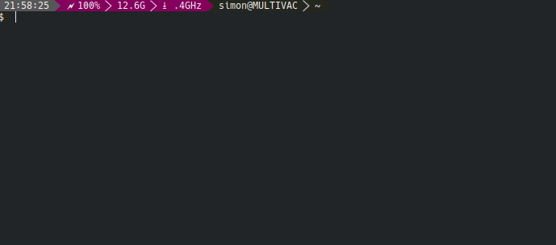
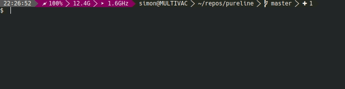

PureLine - A Pure Bash Powerline PS1 Command Prompt`
===================================================

This PureLine-Version is the installation of PureLine I use on my own computer, based on [PureLine](https://github.com/chris-marsh/pureline). Installation instructions on the main git. I've added the following functions (in Powerline, they would be called 'segments'):

1. Showing the free memory.
2. Showing the minimal CPU frequency as well as the current CPU frequency alternating. Will work only on recent Intel CPUs.
3. Notification, if running as root.

Tested with the Hack Regular Font for Powerline.

It is already running a bit slow for me. I'm sure, this could be done more efficiently than I've implemented these functions.

Features to come: 

- Right-aligned segments